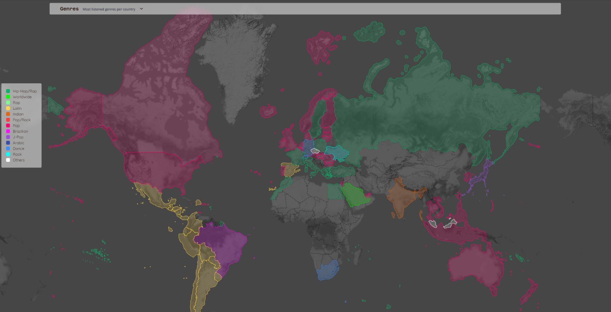
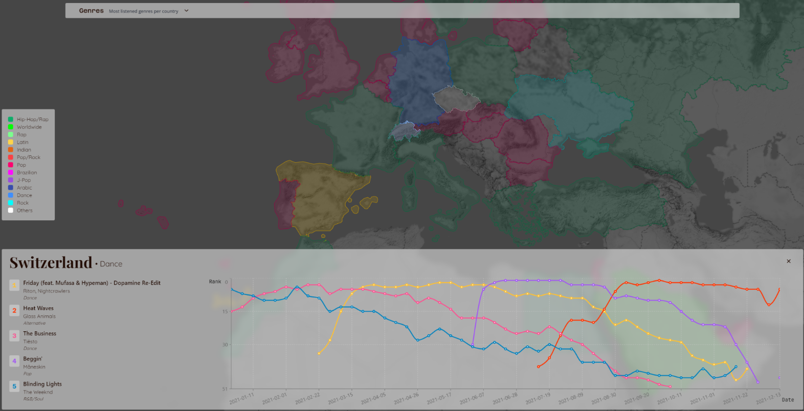

# Project of Data Visualization (COM-480)

| Student's name  | SCIPER |
| --------------  | ------ |
| Nathan Maire    | 313202 |
| Edouard Lacroix | 313192 |
| Nicolas Jimenez | 283057 |

[Milestone 1](#milestone-1) • [Milestone 2](#milestone-2) • [Milestone 3](#milestone-3)

## Milestone 1 (23rd April, 5pm)

**10% of the final grade**

This is a preliminary milestone to let you set up goals for your final project and assess the feasibility of your ideas.
Please, fill the following sections about your project.

*(max. 2000 characters per section)*

### Dataset

> Find a dataset (or multiple) that you will explore. Assess the quality of the data it contains and how much preprocessing / data-cleaning it will require before tackling visualization. We recommend using a standard dataset as this course is not about scraping nor data processing.
>
> Hint: some good pointers for finding quality publicly available datasets ([Google dataset search](https://datasetsearch.research.google.com/), [Kaggle](https://www.kaggle.com/datasets), [OpenSwissData](https://opendata.swiss/en/), [SNAP](https://snap.stanford.edu/data/) and [FiveThirtyEight](https://data.fivethirtyeight.com/)), you could use also the DataSets proposed by the ENAC (see the Announcements section on Zulip).

We will use 3 sources of data for this project, they are listed below:
1. [Spotify Charts](https://www.kaggle.com/datasets/dhruvildave/spotify-charts?resource=download) containing all the "Top200" and "Viral50" categories published by spotify and available on their app as playlists.
2. [Shazam API](https://rapidapi.com/apidojo/api/shazam) which is also a great resource to query data about tracks, albums or artists and we will use it as a complement to the spotify data.
3. [OpenStreetMap](https://www.openstreetmap.org/#map=9/46.8246/8.2245) dataset containing geometries of countries, and much more (which we will not use in our case). 

### Problematic

> Frame the general topic of your visualization and the main axis that you want to develop.
> - What am I trying to show with my visualization?
> - Think of an overview for the project, your motivation, and the target audience.

The main topics we want to address are the following:
- Explore the geographical trends in music
- Discover new titles
- Analyse the music trends over time 

All of us are passionate about music, we have been using Spotify, Souncloud, Shazam and others for years now. We enjoy discovering new songs frequently and share our passion. 
Nevertheless, finding new musics or artists is difficult and the recommendations algorithm used by the apps enumerated earlier are still far from perfect. Moreover, these algorithms tend to 
always recommend what we "want" to hear - similar titles as the ones that are already in our playlists. This is were our project comes to life: building an app - a tool - that will allow anyone to discover new genres and new artists in a visual and entertaining manner. 

More concretely, we would like to display a map of the world. Data could be shown as shapes, popups, graphs, colors as well as text. 
The website will consist of a map where each country will have:
- a color correspoding to the most listened genre 
- a popup on clickEvent with the top 5 most streamed tracks and a chart to naviguate and see the evolution of their streams over time.
Moreover, we would like to add ... (filter) 

### Exploratory Data Analysis

> Pre-processing of the data set you chose
> - Show some basic statistics and get insights about the data

###### Spotify Charts
"Top200" and "Viral50" charts are refreshed every 2-3 days and data has been collected since 2017 summing it up to around 3.5GB of data. 

Each row contains: (title, rank, date, artists, url, region, chart, trend, streams)

We are going to focus only on:
- The "title": title of the music ( waka waka )
- The "rank": the rank of the song between the top200 or viral50
- The "artists": the artists on the song 
- The "region": the country ( Germany )
- The “chart”: either ‘top200’ (=200 most streamed song) or ‘viral50’ (=50 most viral songs)
- The "streams": the music streams

Virality is mesure with the streams, the saves in playlist, shares and time listened on a timeframe given (1 day, 1 week ...)
Number of rows in the dataset: XX
Number of countries represented: 69 + “global” (world)

### Related work

> - What others have already done with the data?
> - Why is your approach original?
> - What source of inspiration do you take? Visualizations that you found on other websites or magazines (might be unrelated to your data).
> - In case you are using a dataset that you have already explored in another context (ML or ADA course, semester project...), you are required to share the report of that work to outline the differences with the submission for this class.

## Milestone 2 (7th May, 5pm)

**10% of the final grade**
### Task:
Two A4 pages describing the project goal.
• Include sketches of the vizualiation you want to make in your final product.
• List the tools that you will use for each visualization and which (past or future)
lectures you will need.
• Break down your goal into independent pieces to implement. Try to design a
core visualization (minimal viable product) that will be required at the end.
Then list extra ideas (more creative or challenging) that will enhance the
visualization but could be dropped without endangering the meaning of the
project.

Functional project prototype review.
• You should have an initial website running with the basic skeleton of the
visualization/widgets.

#### Introduction:
Music is becoming more and more a way to live the daily moments of our life. We listen to music when we are entertained, when we are working, when we are sad or happy. To understand what people listen to is to understand who they are.
Our goal with this project is to allow people to have an overview of what people in each country are listening to, but also to be able to discover new artists from different cultures, or simply to be up to date on the best tracks of the last few years.

#### Goal and subgoals of the project: 
We want to develop a website with a map that would show the most listened genre per country. For each country, the 5 most streamed music in 2021 can be shown in a popup after clicking on the said country, along with a graph that depicts the evolution of ranks for these 5 songs. Moreover, we also would like to create a different map, this time showing the “propagation” of a specific music in the top50, i.e. the evolution of a song on the top50 ranking per country over time.

#### Core steps:
1. Spotify / Shazam and OSM data collection, preprocessing and storage: 
Firstly, the “spotify charts” dataset from Kaggle needs to be preprocessed because the formatting is not ideal (need to extract the track id from the url for instance), there are some missing values (the streams column is null for the chart called viral50), and we will limit ourselves to data from 2021 because of hardware limitations (memory and speed).
Secondly, we need to compute the 5 most listened tracks of each country from the 2021 Spotify charts data that we preprocessed.
Thirdly, the Shazam API will be queried to retrieve the genres associated with each track.
Fourthly, the OSM data will be fetched using the Overpass API to get the countries shape as Geometry objects (PostgreSQL type)
Finally, all this data will be stored in tables in a PostgreSQL database.
2. Map, popup and other components integration:
The web components will be built using Next.js, a trendy Javascript framework based on React. The map will be displayed using the “leaflet” package and charts will be plotted using the “recharts” package.
3. Backend architecture:
The last part to make this project come together is the backend, which will mainly act as a link between the frontend and the database. It will be built in Scala using the Play framework for the server and the Slick package for establishing and querying the Postgres database.

#### Tools and lectures:
1. Map (lecture 8): We will use a map to represent our data visualization. We needed to define what type of map we were going to use and how we would represent the data on it. We decided to use a normal world map in 2d and we used colors to represent the genre of the top music listened for each country. We mainly used the leaflet library to represent the map. 
2. Color choice (lecture 6) and Designing Viz (lecture 7): We took into account lecture 6 and 7 to choose our visual encodings. Creating a map that is uncluttered and colorful while trying to avoid overwhelming the user is one of our focuses. We will strive to share our data in the most simple and easy-to-use manner.

#### Sketches:  
1. In the following screenshot, one can see colors on countries in a map. Each color represents the “main genre” computed from the 5 most streamed tracks.

2. On this second screenshot, we can see the pop-up that appears when one clicks on a country. The top 5 songs for the country are listed with their associated genres, and a chart plots the evolution of each music in terms of rank on the top50 over a year.

## Milestone 3 (4th June, 5pm)

**80% of the final grade**

## Late policy

- < 24h: 80% of the grade for the milestone
- < 48h: 70% of the grade for the milestone

